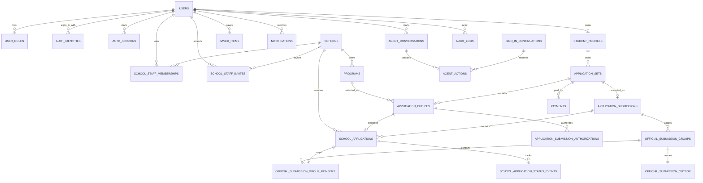

# CUAC Database ERD Spec

Date: 2026-08-14

Status: production schema design draft.

Decision update (2026-09-01): the user confirmed one independent Program Application per concrete `program + intake`, not one per school. `0030` implements Official Submission Groups as transport adapters for one or several Program Applications without merging identity, evidence or state. The reviewed chain now includes exact disclosure authorization, authenticated material snapshot, explicit route/policy, project fee entitlement and atomic internal acceptance. See [the atomic submission contract](CUAC_ATOMIC_APPLICATION_SUBMISSION_CONTRACT.md), [the submission backend contract](CUAC_APPLICATION_SUBMISSION_BACKEND_CONTRACT.md) and [official policy/group contract](CUAC_OFFICIAL_SUBMISSION_POLICY_AND_GROUP_CONTRACT.md). This remains a historical design draft; implemented columns and constraints are authoritative in `frontend/src/server/db/schema.ts` and reviewed migrations.

## 1. Purpose

This document defines the database model needed to turn the CUAC frontend demo into a mature production product. The schema is designed for:

- student accounts and profiles;
- China program and university catalog;
- saved items and comparisons;
- application sets and choices;
- per-program application records with school tenant scope;
- school tenant isolation;
- payments;
- notifications;
- analytics events;
- Agent actions and audit logs.

The recommended primary database is PostgreSQL.

## 2. Design Principles

- Use stable UUID primary keys.
- Use explicit foreign keys for core transactional data.
- Use soft deletes for user-facing and admin-managed records.
- Use append-only event and audit tables.
- Use `tenant_school_id` on school-scoped records.
- Never rely on frontend filtering for tenant isolation.
- Store external source evidence for catalog data.
- Prefer enum lookup tables or constrained strings for states.
- Keep files out of MVP unless the business expands into document management.

## 3. High-Level ERD



## 4. Identity And Access Tables

### users

Core authenticated person or service identity.

Fields:

- id uuid pk
- email citext unique
- password_hash nullable
- display_name text
- avatar_url text nullable
- primary_account_type text: person, service
- intended_surface text nullable: student, school_staff, cuac_internal
- status text: active, invited, suspended, deleted
- mfa_required boolean default false
- email_verified_at timestamptz nullable
- last_login_at timestamptz nullable
- created_at timestamptz
- updated_at timestamptz

### user_roles

Global roles.

Fields:

- id uuid pk
- user_id uuid fk users
- role text: student, cuac_ops, cuac_admin, agent_service
- created_at timestamptz

Unique:

- user_id, role

### auth_identities

Login identity attached to a user. A user may have password, OAuth, school SSO, or CUAC SSO identities, but authorization boundaries come from roles, school memberships, and approved access grants, not from separate account systems.

Fields:

- id uuid pk
- user_id uuid fk users
- provider text: password, google, school_sso, cuac_sso
- provider_subject text nullable
- intended_surface text nullable: student, school_staff, cuac_internal
- email citext
- password_hash nullable
- mfa_enrolled_at timestamptz nullable
- last_used_at timestamptz nullable
- created_at timestamptz
- updated_at timestamptz

Unique:

- provider, provider_subject
- provider, email

### auth_sessions

Server-side session record for web/API access.

Fields:

- id uuid pk
- user_id uuid fk users
- selected_surface text: student, school_staff, cuac_internal, service
- active_role text: student, school_staff, cuac_ops, cuac_admin, agent_service
- tenant_school_id uuid fk schools nullable
- created_at timestamptz
- expires_at timestamptz
- revoked_at timestamptz nullable
- last_seen_at timestamptz nullable
- user_agent_hash text nullable
- ip_hash text nullable

### school_staff_invites

Invitation or approved request that lets a signed-in CUAC account join one school tenant. Registration creates the account; this table creates the school permission grant.

Fields:

- id uuid pk
- school_id uuid fk schools
- email citext
- role text: owner, admissions_staff, program_manager, read_only
- token_hash text
- status text: pending, accepted, expired, revoked
- invited_by_user_id uuid fk users nullable
- accepted_by_user_id uuid fk users nullable
- expires_at timestamptz
- created_at timestamptz
- accepted_at timestamptz nullable

### cuac_staff_access_grants

Approval record that grants CUAC internal permissions to an existing CUAC account. Registration creates the account; this table and `user_roles` create the internal authority.

Fields:

- id uuid pk
- user_id uuid fk users
- email citext
- requested_surface text: cuac_internal
- requested_role text: cuac_ops, cuac_admin
- grant_source text: team_invite, sso_claim, admin_assignment, manual_approval
- status text: pending, approved, denied, revoked, expired
- token_hash text nullable
- requested_by_user_id uuid fk users nullable
- approved_by_user_id uuid fk users nullable
- reason text nullable
- expires_at timestamptz nullable
- created_at timestamptz
- approved_at timestamptz nullable
- revoked_at timestamptz nullable

Rules:

- A CUAC staff registration may create `users` and `auth_identities`, but it must not create `user_roles.role = cuac_ops` or `cuac_admin` until an approved grant exists.
- Approved grants are audited and then materialized into `user_roles`; revoked grants must revoke or disable the corresponding internal session surface.
- `grant_source = sso_claim` is still an access grant, not a separate account system.

### sign_in_continuations

Short-lived pending action created when a visitor starts a protected action before sign-in or registration.

Fields:

- id uuid pk
- continuation_token_hash text unique
- action_key text
- route text
- allowed_access_contexts text[] nullable: student, school_staff, cuac_internal
- required_access_context text nullable: student, school_staff, cuac_internal
- required_role text nullable
- tenant_school_id uuid fk schools nullable
- payload_preview_json jsonb default '{}'
- device_fingerprint_hash text nullable
- status text: pending, consumed, expired, denied
- created_at timestamptz
- expires_at timestamptz
- consumed_at timestamptz nullable

Rules:

- Store only minimal replay metadata. Do not store long-term Agent memory, full student profile, payment details, or school queue data in this table.
- `allowed_access_contexts` and `required_access_context` describe action policy, not the signed-out visitor's identity.
- Consume once, then re-run authorization against the authenticated user, role, tenant membership, and action policy.
- Account registration may consume a continuation only if the authenticated user receives the role, membership, or access grant needed by the action. Cross-context, cross-role, or cross-tenant replay must be denied.

### schools

School tenant.

Fields:

- id uuid pk
- slug text unique
- name_en text
- name_zh text nullable
- city_id uuid fk cities nullable
- province text
- status text: draft, active, paused, archived
- tenant_status text: onboarding, live, suspended
- international_office_email text nullable
- website_url text nullable
- admissions_url text nullable
- source_status text: verified, stale, pending
- school_type text nullable
- region text nullable
- city text nullable
- city_zh text nullable
- city_slug text nullable
- region_label text nullable
- ranking integer nullable
- csca_required boolean default false
- csca_requirement text nullable
- csca_subjects jsonb default '[]'
- application_level text nullable
- language_of_instruction jsonb default '[]'
- language_requirement text nullable
- hsk_requirement text nullable
- english_requirement text nullable
- deadline_summary text nullable
- tuition_summary text nullable
- application_fee text nullable
- source_url text nullable
- source_label text nullable
- source_note text nullable
- source text nullable
- source_id text nullable
- verification_status text nullable
- quality_score integer nullable
- missing_fields jsonb default '[]'
- completeness_label text nullable
- subject_tags jsonb default '[]'
- fit_notes jsonb default '[]'
- language_tags jsonb default '[]'
- tuition_band_label text nullable
- program_subject_tags jsonb default '[]'
- program_tuition_band_label text nullable
- program_quality_issues jsonb default '[]'
- required_subject_tags jsonb default '[]'
- application_portal_notes text nullable
- campus_highlights jsonb default '[]'
- contact_notes text nullable
- last_verified_at timestamptz nullable
- created_at timestamptz
- updated_at timestamptz

### school_staff_memberships

Maps users to school tenants.

Fields:

- id uuid pk
- school_id uuid fk schools
- user_id uuid fk users
- role text: owner, admissions_staff, program_manager, read_only
- status text: invited, active, suspended, removed
- invited_by_user_id uuid fk users nullable
- created_at timestamptz
- updated_at timestamptz

Unique:

- school_id, user_id

## 5. Catalog Tables

### Catalog Legacy Compatibility Rule

The catalog layer must preserve CSCAlite field lineage. Physical database columns use snake_case, but API and frontend domain DTOs expose CSCAlite-compatible camelCase names from `SchoolRecord`, `SchoolProgramRecord`, `PublicScholarship`, `SchoolScholarshipRecord`, `CityGuide`, and `CityGuideAggregate`. CUAC aliases may supplement those names, but must not replace the canonical field family documented in `CUAC_LEGACY_FIELD_MAPPING_SPEC.md`.

Catalog and school handoff rows should preserve machine-readable source lineage. Use JSONB snapshots for `source_field_lineage_json` where the source is a mixed projection or a point-in-time handoff. This is metadata for Agent citation, audit, and data-quality review; it must still obey tenant isolation.

SchoolRecord-compatible columns live mostly on `schools`: `name_zh`, `name_en`, `school_type`, `region`, `city`, `city_zh`, `city_slug`, `region_label`, `ranking`, `csca_required`, `csca_requirement`, `csca_subjects`, `application_level`, `language_of_instruction`, `language_requirement`, `hsk_requirement`, `english_requirement`, `deadline_summary`, `tuition_summary`, `application_fee`, `official_website_url` or `website_url`, `admissions_website_url` or `admissions_url`, `source_url`, `source_label`, `source_note`, `source`, `source_id`, `last_verified_at`, `verification_status`, `quality_score`, `missing_fields`, `completeness_label`, `subject_tags`, `fit_notes`, `language_tags`, `tuition_band_label`, `program_subject_tags`, `program_tuition_band_label`, `program_quality_issues`, `required_subject_tags`, `application_portal_notes`, `campus_highlights`, `contact_notes`, and `status`.

SchoolProgramRecord-compatible columns live on `programs` and `program_intakes`: `school_id`, `name_zh`, `name_en`, `degree_level`, `duration_years`, `duration_months`, `field_category`, `subject_area`, `teaching_language`, `csca_subjects`, `csca_requirement`, `hsk_requirement`, `english_requirement`, `tuition_amount`, `tuition_currency`, `tuition_period`, `tuition_text`, `scholarship_text`, `open_date`, `deadline_date`, `deadline_label`, `application_round`, `application_url`, `application_note`, `source_url`, `source_label`, `last_verified_at`, `sort_order`, `status`, `is_verified`, `has_scholarship`, `badge_text`, `display_tuition`, `display_subjects`, `display_group`, and `display_group_label`.

PublicScholarship-compatible columns live on `scholarships`: `slug`, `title`, `name_zh`, `type`, `type_label`, `funding_level`, `provider_name`, `provider_name_en`, `provider_location`, `school_id`, `program_id`, `coverage`, `applicable_degree`, `applicable_program`, `amount_text`, `requirement_text`, `body_sections`, `benefit_items`, `eligibility_items`, `application_materials`, `application_steps`, `contact_info`, `action_links`, `deadline_date`, `deadline_label`, `application_round`, `target_countries`, `target_regions`, `benefits`, `source_url`, `source_label`, `last_verified_at`, `sort_order`, `tags`, `summary`, `status`, and `version`.

CityGuide-compatible columns live on `cities`: `slug`, `name_zh`, `name_en`, `region`, `province`, `monthly_cost`, `monthly_cost_rmb`, `cost_level`, `density`, `tags`, `content_json`, `nearby`, `reference_school_count`, `reference_program_count`, `reference_english_program_count`, `reference_scholarship_count`, `reference_csca_school_count`, `sort_order`, `version`, and `updated_at`. `CityGuideAggregate` count fields should be derived from catalog records or a materialized view, not hand-entered in the editorial guide.

### cities

Fields:

- id uuid pk
- slug text unique
- name_en text
- name_zh text nullable
- region text nullable
- province text
- monthly_cost text nullable
- monthly_cost_rmb integer nullable
- cost_level text: low, medium, high, unknown
- density text nullable
- tags jsonb default '[]'
- content_json jsonb default '{}'
- nearby jsonb default '[]'
- reference_school_count integer default 0
- reference_program_count integer default 0
- reference_english_program_count integer default 0
- reference_scholarship_count integer default 0
- reference_csca_school_count integer default 0
- climate_summary text nullable
- student_life_summary text nullable
- source_status text
- sort_order integer default 0
- version integer default 1
- last_verified_at timestamptz nullable
- updated_at timestamptz nullable

### programs

Fields:

- id uuid pk
- school_id uuid fk schools
- slug text unique
- name_en text
- name_zh text nullable
- degree_level text: undergraduate, master, phd, non_degree
- duration_years numeric nullable
- field_category text nullable
- subject_area text
- teaching_language text: english, chinese, bilingual
- city_id uuid fk cities
- duration_months integer nullable
- csca_subjects jsonb default '[]'
- csca_requirement text nullable
- hsk_requirement text nullable
- english_requirement text nullable
- tuition_amount numeric nullable
- tuition_currency text default 'RMB'
- tuition_period text: year, program, semester
- tuition_text text nullable
- scholarship_text text nullable
- open_date date nullable
- deadline_date date nullable
- deadline_label text nullable
- application_round text nullable
- application_url text nullable
- application_note text nullable
- status text: open, limited, closed, unknown
- is_verified boolean default false
- has_scholarship boolean default false
- sort_order integer default 0
- badge_text text nullable
- display_tuition text nullable
- display_subjects jsonb default '[]'
- display_group text nullable
- display_group_label text nullable
- source_status text: verified, stale, pending
- source_url text nullable
- source_label text nullable
- last_verified_at timestamptz nullable
- created_by_user_id uuid fk users nullable
- updated_by_user_id uuid fk users nullable
- created_at timestamptz
- updated_at timestamptz

Indexes:

- school_id
- degree_level, teaching_language
- subject_area
- city_id
- source_status

### program_intakes

Fields:

- id uuid pk
- program_id uuid fk programs
- intake_term text: spring, fall, rolling
- intake_year integer
- deadline_date date nullable
- deadline_label text nullable
- application_round text nullable
- deadline_status text: open, closes_soon, urgent, late_intake, closed, unknown
- capacity_status text: open, limited, full, unknown
- created_at timestamptz
- updated_at timestamptz

### scholarships

Fields:

- id uuid pk
- slug text unique
- title text
- name_en text
- name_zh text nullable
- type text: government, university, city, external
- type_label text nullable
- funding_level text nullable
- provider_name text nullable
- provider_name_en text nullable
- provider_location text nullable
- school_id uuid fk schools nullable
- program_id uuid fk programs nullable
- coverage text: full, partial, tuition_waiver, stipend, unknown
- applicable_degree text nullable
- applicable_program text nullable
- amount_text text nullable
- requirement_text text nullable
- body_sections jsonb default '[]'
- benefit_items jsonb default '[]'
- eligibility_items jsonb default '[]'
- application_materials jsonb default '[]'
- application_steps jsonb default '[]'
- contact_info jsonb nullable
- action_links jsonb default '[]'
- deadline_date date nullable
- deadline_label text nullable
- application_round text nullable
- target_countries jsonb default '[]'
- target_regions jsonb default '[]'
- benefits jsonb default '[]'
- source_url text nullable
- source_label text nullable
- source_status text
- sort_order integer default 0
- tags jsonb default '[]'
- summary text nullable
- status text: draft, published, archived
- version integer default 1
- last_verified_at timestamptz nullable

### program_scholarships

Fields:

- program_id uuid fk programs
- scholarship_id uuid fk scholarships
- eligibility_note text nullable

Primary key:

- program_id, scholarship_id

### catalog_source_evidence

Stores proof for program, school, scholarship, and guide data.

Fields:

- id uuid pk
- entity_type text
- entity_id uuid
- source_url text
- source_label text nullable
- captured_at timestamptz
- captured_by_user_id uuid fk users nullable
- evidence_note text nullable
- checksum text nullable

## 6. Student Tables

### student_profiles

Fields:

- id uuid pk
- user_id uuid fk users unique
- full_name text
- nationality text nullable
- country_region text nullable
- phone text nullable
- whatsapp text nullable
- current_education_level text nullable
- latest_school_name text nullable
- target_degree_level text nullable
- target_intake_year integer nullable
- preferred_teaching_language text nullable
- budget_max_rmb_per_year integer nullable
- funding_intent text nullable
- language_status text nullable
- readiness_note text nullable
- profile_completeness integer default 0
- created_at timestamptz
- updated_at timestamptz

### saved_items

Fields:

- id uuid pk
- user_id uuid fk users
- item_type text: program, school, scholarship, city, guide
- item_id uuid
- note text nullable
- created_at timestamptz

Unique:

- user_id, item_type, item_id

## 7. Application Tables

### application_sets

One student submission cycle.

Fields:

- id uuid pk
- student_profile_id uuid fk student_profiles
- status text: draft, info_incomplete, ready_to_submit, payment_required, payment_failed, submitted, closed, withdrawn
- title text nullable
- target_intake_year integer nullable
- consent_shared_at timestamptz nullable
- submitted_at timestamptz nullable
- created_at timestamptz
- updated_at timestamptz

### application_choices

One concrete school/program route selected by the student.

Fields:

- id uuid pk
- application_set_id uuid fk application_sets
- program_id uuid fk programs
- school_id uuid fk schools
- program_intake_id uuid fk program_intakes nullable
- admission_route_key text nullable; added by `0027`, no default/backfill/inference, non-null writes require the exact current reviewed target policy
- rank_order integer
- role text: main, backup, funding, exploratory
- teaching_language text
- intake_label text
- student_note text nullable
- selected_by_student_json jsonb default '{}'
- source_field_lineage_json jsonb default '{}'
- status text: draft, ready, removed, submitted
- created_at timestamptz
- updated_at timestamptz

Indexes:

- application_set_id
- school_id
- program_id
- partial target/route lookup for non-null admission_route_key

### school_applications

One program choice's school-scoped application record. The same school may receive multiple independent records from one set; each has its own status and history.

Fields:

- id uuid pk
- application_set_id uuid fk application_sets
- application_choice_id uuid fk application_choices
- program_id uuid fk programs (required for a new submission; immutable program snapshot needed for later catalog removal)
- program_intake_id uuid fk program_intakes; exact project cycle, not a school-level intake label
- student_profile_id uuid fk student_profiles
- tenant_school_id uuid fk schools
- application_record_format text: historical `cuac.program-application.v1` or evidence-complete `cuac.program-application.v2`
- application_submission_id uuid fk application_submissions nullable only for historical v1
- admission_route_key text nullable only for historical v1
- authorization_id, material_snapshot_id, fee_entitlement_id uuid nullable only for historical v1
- requirement_version_id, requirement_publication_revision, requirement_content_sha256 nullable only for historical v1
- policy_version_id, policy_publication_revision and policy document/target/review digests nullable only for historical v1
- accepted_at timestamptz nullable only for historical v1
- status text: new, needs_review, contact_queued, contacted, waiting_for_documents, documents_received_by_school, not_a_fit, converted_to_official_application, archived
- source text: live_cuac_submission, sample, ops_import
- priority text: high, normal, low
- owner_user_id uuid fk users nullable
- submitted_at timestamptz
- first_viewed_at timestamptz nullable
- first_contacted_at timestamptz nullable
- next_action text nullable
- due_at timestamptz nullable
- school_visible_student_snapshot_json jsonb default '{}'
- information_sources_json jsonb default '{}'
- source_field_lineage_json jsonb default '{}'
- not_collected_by_cuac_json jsonb default '[]'
- internal_note text nullable
- created_at timestamptz
- updated_at timestamptz

Identity and evidence constraints:

- application_choice_id; the current schema also checks choice/set/student/school scope with a composite foreign key. Do not add a unique constraint on application_set_id + school_id.
- v2 requires one exact submission, route, authorization, authenticated snapshot, fee entitlement, requirement publication and policy target; composite foreign keys reject a same-school sibling project's evidence.
- historical rows remain v1 with all new evidence columns null. `0030` changes the default to v2 so an old incomplete writer fails closed.

### application_submission_authorizations

Implemented by `0024` and extended by `0028`. One immutable evidence row binds a student's explicit confirmation to one exact `application_choice`, school, program and intake plus the selected-material revision, four source revisions, canonical selection/content digests and the active reviewed notice publication evidence. Every new row is `cuac.application-submission-authorization.v2` and also binds the choice's explicit route, exact policy version/publication revision, and server-validated policy document/target-set/approval digests.

Policy-bound columns are `authorization_format`, `admission_route_key`, `policy_version_id`, `policy_publication_revision`, `policy_document_sha256`, `policy_target_set_sha256`, and `policy_approval_sha256`. A CHECK allows only a complete legacy v1 null-policy shape or a complete valid v2 shape; a composite foreign key binds each v2 row to the exact policy-version school/program/intake/route target. Existing v1 rows are preserved without inferred backfill and are always non-current.

Lifecycle is `active`, `withdrawn` or `superseded`; each choice has at most one active row, while ended evidence is retained. The table does not contain material bodies, payment credentials, Agent messages or a school receipt. School, Ops summary, Agent and Billing readers have no direct projection. A current authorization is a prerequisite for later submission, not the submission itself.

### official_submission_policy_versions

Implemented by `0026`. Each row is an immutable reviewed policy version for one school and policy key. It stores a schema-versioned rule document, canonical SHA-256, explicit form/ordering/channel fields, source and review evidence, validity/review windows, preparer and a distinct reviewer. It has no student material, payment data, portal credential or Agent content.

### official_submission_policy_version_targets

Implemented by `0026`. Each row binds one policy version to one exact `school + program + program_intake`; composite foreign keys reject cross-school, wrong-program and wrong-intake targets. The target set is content-bound to the version and cannot be inferred from a school name, demo copy, catalog prose, Agent output or existing choices.

### official_submission_policy_publications

Implemented by `0026`. One CAS-controlled pointer per exact `program_intake + admission_route_key` identifies the current active/withdrawn reviewed version, its revision and bound digests. There is no default route. Readers verify target, rule, review and publication integrity and fail closed on mismatch.

### application_submissions

Implemented by `0030`. One row is the atomic CUAC acceptance root for one owned Application Set. It binds the source revision, exact choice/group counts, canonical manifest, authenticated explicit confirmation request, accepted state and database timestamps. `application_set_id` is unique, so a second key cannot create a duplicate accepted batch.

### official_submission_groups

Implemented by `0030`. One immutable transport group binds a submission, student, set, school, route, reviewed policy version/digests, form mode, ordering mode, channel type, sequence, member count and member manifest. `one_program_per_form` enforces one member; `multi_program_form` may contain several up to the locked policy maximum. Transport status cannot become a project admission decision.

### official_submission_group_members

Implemented by `0030`. Each member maps exactly one Program Application and repeats its choice, program, intake, authorization, snapshot and entitlement identity plus a stable position and digest. One Program Application can belong to only one group. Composite foreign keys prevent cross-student, cross-set, cross-school, cross-route, cross-policy or same-school sibling substitution.

### official_submission_outbox

Implemented by `0030` as one inert pending row per group. It stores only submission/group/school identity, event/payload formats, manifest, bounded lease metadata and terminal timestamps/error code. It contains no material plaintext, payment credential, school credential or provider response. No worker consumes it in the current product.

### application_material_snapshots

Implemented by `0025`. One immutable owner-only encrypted package belongs to one authorization and therefore one exact student/set/choice/school/program/intake target. The authorization foreign key is unique; composite foreign keys repeat the complete target so a row cannot be rebound to another same-school project or intake.

Stored metadata is limited to source/selection revisions, canonical digests, payload byte/format metadata, encryption scheme/key identifier, an authenticated envelope, request ID and database capture time. Applicant, education and assessment bodies exist only inside the AES-256-GCM payload; there is no plaintext material or selection column. The table has no update/delete API and creates no `school_applications` row. Student GET/POST return a metadata-only DTO; school, Ops, Agent and Billing have no reader.

An `official_submission_group_member` references one Program Application and its exact authorized snapshot according to the locked reviewed rule. The group does not own student material, replace per-program authorization or collapse independent project status.

### school_application_program_interests

Withdrawn proposal. Do not create this table to merge same-school choices. Each school_application links directly to one choice/program and will carry that program's approved snapshot/lineage. Multi-program school grouping belongs in an authorized read projection, not a shared application entity.

### school_application_status_events

Append-only status history.

Fields:

- id uuid pk
- school_application_id uuid fk school_applications
- from_status text nullable
- to_status text
- actor_user_id uuid fk users nullable
- actor_type text: student, school_staff, cuac_ops, agent, system
- note text nullable
- created_at timestamptz

## 8. Payment Tables

### invoices

Implemented business-state aggregate owned by one user and optionally one Application Set. Key fields are `id`, `user_id`, `application_set_id`, `billing_customer_id`, `status`, `currency`, subtotal/discount/total minor units, hosted-provider business references, idempotency key and timestamps. The invoice owns lines and payments; it does not point to one payment, and it stores no card/bank credential or raw provider payment source.

### invoice_lines

`0029` distinguishes historical `cuac.invoice-line.v1` rows from exact `cuac.invoice-line.v2` rows. New v2 `application_fee` lines bind:

- `invoice_id`, `user_id`, `application_set_id`, `application_choice_id`;
- `school_id`, `program_id`, `program_intake_id`, generated target key and `admission_route_key`;
- line type, fee code, amount minor, currency and `pricing_basis_sha256`.

Composite foreign keys bind invoice ownership, exact choice scope, exact program/intake target and school relationship. A v2 `service_fee` may bind the user and Application Set while leaving project fields null; it cannot be used as application entitlement evidence. Historical v1 rows keep all new exact fields null and are never inferred from metadata or current choices.

### payments

One payment belongs to one invoice and user. Key fields are hosted provider/business identifiers, status, amount minor, currency, public failure fields and paid/cancelled timestamps. Provider checkout IDs are unique when present. Raw PAN, CVV/CVC, bank account/routing data, provider payment tokens and raw payment-source payloads are prohibited.

### payment_status_events

Append-only business transition evidence for one payment: from/to status, optional provider event ID, public reason, bounded metadata and timestamp. Exact `(event, payment, to_status)` identity is referenced by an entitlement; a standalone client status or Agent statement is not payment authority.

### application_fee_entitlements

Implemented by `0029`. One entitlement proves that one exact Program Application choice currently satisfies the platform fee condition. It binds the same `user + set + choice + school + program + intake + route` as its v2 application-fee line, plus the exact invoice, settled payment, success event, fee code, amount, currency and pricing-basis digest.

Lifecycle is `active` or `revoked`, with grant/expiry/revocation timestamps and a hashed idempotent grant key. Composite foreign keys prevent an entitlement from being rebound to a sibling project at the same school or to another invoice/payment/event. Currentness additionally requires the live choice target/route and settled payment evidence still to match; refund, expiry, revocation or target/route changes make it unavailable without rewriting history.

This table is project-scoped, not school-scoped. A later bundle, waiver or one-form pricing policy may cover several projects, but every project allowed to submit still needs exact entitlement evidence. Student preflight receives only `{ id, status, grantedAt, expiresAt, current }`; school, Ops and Agent have no grant route or raw payment projection. See [the Billing entitlement contract](CUAC_APPLICATION_BILLING_ENTITLEMENT_CONTRACT.md).

## 9. Communication Tables

### notifications

Fields:

- id uuid pk
- user_id uuid fk users
- type text
- title text
- body text
- entity_type text nullable
- entity_id uuid nullable
- read_at timestamptz nullable
- created_at timestamptz

### contact_logs

School-side contact records.

Fields:

- id uuid pk
- school_application_id uuid fk school_applications
- actor_user_id uuid fk users
- channel text: email, phone, whatsapp, other
- direction text: outbound, inbound
- summary text
- created_at timestamptz

## 10. Agent And Audit Tables

### agent_conversations

Fields:

- id uuid pk
- user_id uuid fk users nullable
- surface text: home, programs, hub, application, school_portal, ops
- context_scope text: guest_page, student_account, school_tenant, ops_audit
- retention_policy text: current_page_session, application_lifecycle, tenant_work_session, ops_audit_retention
- tenant_school_id uuid fk schools nullable
- application_set_id uuid fk application_sets nullable
- expires_at timestamptz nullable
- cleared_at timestamptz nullable
- model_provider text nullable
- model_name text nullable
- created_at timestamptz

Rules:

- Signed-out public visitors use `context_scope = guest_page` and must not create durable account memory. If the implementation records an operational request row, it must have short `expires_at`, no `user_id`, and no profile/application payload.
- Signed-in students use `context_scope = student_account` and may retain memory through the application lifecycle until the student clears memory, enrolls, or the cycle is archived.
- School staff use `context_scope = school_tenant`, must include `tenant_school_id`, and must never inherit student private Agent memory.
- CUAC Ops uses `context_scope = ops_audit`; raw cross-tenant access requires audit and reason.

### agent_messages

Fields:

- id uuid pk
- conversation_id uuid fk agent_conversations
- role text: user, assistant, system, tool
- content text
- redaction_state text: raw, masked
- created_at timestamptz

### agent_memory_entries

Long-lived scoped memory for signed-in student, school tenant, and Ops contexts. Guest page context is intentionally excluded.

Fields:

- id uuid pk
- conversation_id uuid fk agent_conversations nullable
- user_id uuid fk users nullable
- tenant_school_id uuid fk schools nullable
- application_set_id uuid fk application_sets nullable
- context_scope text: student_account, school_tenant, ops_audit
- memory_type text: study_goal, saved_route_summary, application_state_summary, school_queue_summary, ops_audit_summary, preference
- content_json jsonb
- source_entity_type text nullable
- source_entity_id uuid nullable
- created_by_actor_type text: user, agent, system
- expires_at timestamptz nullable
- cleared_at timestamptz nullable
- created_at timestamptz
- updated_at timestamptz

Constraints:

- `context_scope = student_account` requires `user_id`.
- `context_scope = school_tenant` requires `tenant_school_id`.
- `context_scope = ops_audit` requires audit logging for creation and access.
- No row may use `context_scope = guest_page`.

### agent_actions

Fields:

- id uuid pk
- conversation_id uuid fk agent_conversations
- user_id uuid fk users
- action_key text
- action_status text: proposed, confirmed, executed, rejected, failed
- params jsonb
- result jsonb nullable
- requires_confirmation boolean
- pending_after_sign_in boolean default false
- idempotency_key text nullable
- tenant_school_id uuid fk schools nullable
- risk_level text: low, medium, high, prohibited
- confirmed_at timestamptz nullable
- executed_at timestamptz nullable
- created_at timestamptz

Rules:

- Protected actions started by signed-out visitors are not executed immediately. The UI stores a pending action client-side, opens sign-in, then calls the same backend action after real authentication.
- High-risk actions require confirmation, idempotency, and audit.
- School actions must include `tenant_school_id` and pass membership policy before preview or execute.

### audit_logs

Append-only security and business audit.

Fields:

- id uuid pk
- actor_user_id uuid fk users nullable
- actor_type text: user, agent, system, provider
- action text
- entity_type text
- entity_id uuid nullable
- tenant_school_id uuid nullable
- request_id text nullable
- ip_hash text nullable
- user_agent_hash text nullable
- before_snapshot jsonb nullable
- after_snapshot jsonb nullable
- created_at timestamptz

## 11. Analytics Tables

### product_events

Append-only event stream.

Fields:

- id uuid pk
- event_name text
- actor_user_id uuid fk users nullable
- anonymous_id text nullable
- session_id text nullable
- entity_type text nullable
- entity_id uuid nullable
- tenant_school_id uuid nullable
- properties jsonb
- created_at timestamptz

This table can be replicated into a warehouse later.

## 12. Tenant Isolation Rules

Every school portal query must include:

```sql
WHERE school_applications.tenant_school_id IN (:schools_current_user_can_access)
```

School staff must never query `application_sets` directly for inbox views. They query `school_applications` plus the student fields exposed through a school-safe projection.

Recommended approach:

- API-level authorization;
- database row-level security for school-scoped tables;
- school-safe views for reporting;
- audit logs on export.

## 13. MVP Migration From Demo State

Current frontend demo state maps to production data as follows:

| Demo Object | Production Table |
| --- | --- |
| saved cards | saved_items |
| add choice cards | application_choices |
| student info form | student_profiles plus application snapshot |
| fee summary | payments.fee_rule_snapshot |
| submittedRecords | one school_applications record per submitted choice, with approved per-program snapshot/lineage; demo storage is not authority |
| school portal queue | school_applications |
| mark contacted | school_application_status_events plus contact_logs |
